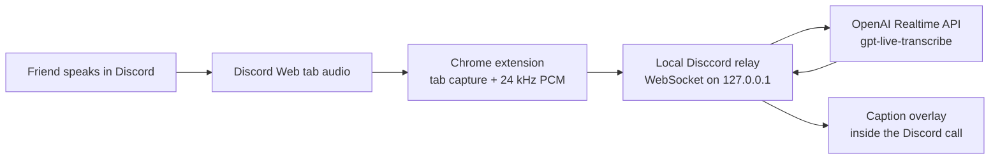

# Disccord

Live closed captions for Discord calls.

Disccord is a proof of concept for the very specific moment when a friend is
talking on a Discord video call and a hair dryer makes them impossible to hear.
The first version runs on **Discord Web in Chrome**: a small extension captures
the audio already playing in the Discord tab, sends it to a local relay, and
draws streaming captions over the call.

> Status: local POC. The repository is intentionally not a Discord client mod
> and does not contain a Discord user token, bot token, or OpenAI API key.

## What we are building



The POC has two pieces:

1. `server/` — a small Node.js WebSocket relay. It keeps the OpenAI API key on
   the server, opens one Realtime transcription session per caption stream, and
   forwards only caption events back to the browser.
2. `extension/` — an unpacked Manifest V3 Chrome extension. Clicking its toolbar
   icon captures the active Discord tab's audio, preserves normal playback,
   streams mono PCM to the relay, and injects the caption overlay.

Only the tab's rendered output is captured. In a normal Discord call that means
the remote participant plus Discord notification sounds; the local microphone
is not played back into the tab and should therefore not be transcribed.

## Why this route

There is no supported “Discord extension” API that can add UI to a normal DM
video call. A Discord bot is also a poor fit for this first use case:

- Discord bots are designed to join server voice channels, not a private
  one-to-one DM call.
- Discord voice is a UDP/Opus protocol, and Discord now requires its DAVE
  end-to-end encryption protocol for voice and video conversations.
- Injecting code into or patching the native Discord client would create a
  brittle client mod and unnecessary account-policy risk.

Chrome already exposes a user-consented tab capture API. Since Chrome 116, a
toolbar click can create a tab stream that an extension's offscreen document
uses in the background. That gives us the audio the user can already hear,
without Discord credentials or protocol interception.

Useful primary references:

- [OpenAI Realtime transcription](https://developers.openai.com/api/docs/guides/realtime-transcription)
  recommends `gpt-live-transcribe` for streaming transcript deltas.
- [OpenAI Realtime WebSocket guide](https://developers.openai.com/api/docs/guides/realtime-websocket)
  documents server-side API-key authentication.
- [Chrome tab capture guide](https://developer.chrome.com/docs/extensions/how-to/web-platform/screen-capture)
  documents service-worker capture and offscreen audio processing.
- [Discord voice documentation](https://docs.discord.com/developers/topics/voice-connections)
  describes its voice transport and DAVE requirements.

## POC scope

### Included

- One-click start/stop while the active tab is `https://discord.com/...`
- Continued playback while the tab is being captured
- Live partial captions and finalized utterances
- Live partial captions with periodic finalized caption segments
- A readable in-call overlay with connection/error state
- Local-only relay by default (`127.0.0.1`)
- Optional shared access key for a later remote relay
- No transcript persistence

### Not included yet

- Native Discord desktop support
- Speaker identification in group calls
- Captions sent to the other participant
- A hosted multi-user service, accounts, billing, or rate limiting
- Transcript history or recording
- Chrome Web Store packaging
- A Discord bot

For “vice versa,” each participant can install and run Disccord locally. A
future consensual room mode could exchange captions between participants, but
it is not necessary to caption the remote audio already arriving in each tab.

## Quick start

Prerequisites:

- Node.js 20 or newer
- Chrome 116 or newer
- An OpenAI API key with access to `gpt-live-transcribe`
- Discord opened at [discord.com/app](https://discord.com/app)

Install and run the relay:

```bash
npm install
npm run dev
```

The relay reads the repository's `.env`. At minimum:

```dotenv
OPENAI_API_KEY=your_api_key
```

Load the extension:

1. Open `chrome://extensions`.
2. Enable **Developer mode**.
3. Choose **Load unpacked** and select this repository's `extension/` folder.
4. Pin Disccord to the toolbar.
5. Join a Discord Web call, then click the Disccord toolbar icon.
6. Click it again to stop.

Chrome shows a capture indicator while Disccord is listening to the tab.

## Configuration

Copy `.env.example` when setting up a new checkout. Supported relay variables:

| Variable | Default | Purpose |
| --- | --- | --- |
| `OPENAI_API_KEY` | required | Server-side OpenAI credential |
| `PORT` | `8787` | Local HTTP/WebSocket port |
| `HOST` | `127.0.0.1` | Bind address; local-only by default |
| `DISCCORD_ACCESS_KEY` | empty | Optional client key for a remote relay |
| `OPENAI_TRANSCRIPTION_MODEL` | `gpt-live-transcribe` | Explicit model override |

The extension defaults to `ws://127.0.0.1:8787/captions`. Its options page can
change the relay URL, optional access key, expected language, and vocabulary
hints without rebuilding the extension.

## Privacy and consent

Disccord sends captured call audio to the configured relay and then to OpenAI
for live transcription. The POC does not save audio or transcripts, but network
services necessarily process the audio while the session is active.

Tell everyone in the call that live transcription is enabled and get their
consent before starting. Recording and interception rules vary by location;
this project is not legal advice. Do not use it for calls where you are not a
participant.

Never put `OPENAI_API_KEY` in the extension. A public relay must add real user
authentication, per-user quotas, abuse controls, TLS (`wss://`), secret
rotation, and an explicit privacy policy. The optional shared access key is only
an early testing gate, not production authentication.

## Testing strategy

The repository uses Node's built-in test runner for deterministic protocol and
audio utilities. The live smoke test is opt-in because it uses the configured
OpenAI account:

```bash
npm test
npm run test:live
```

The live test synthesizes a short PCM tone/silence stream to verify session
setup and API event handling; meaningful recognition still needs a spoken-audio
fixture or a real Discord call.

## Roadmap

1. Validate caption latency and hair-dryer/noise behavior in a real two-person
   Discord Web call.
2. Tune turn boundaries, language, keyword hints, caption lifetime, and
   reconnection.
3. Package a signed Chrome extension.
4. Evaluate a hosted relay. Persistent bidirectional WebSockets and secret
   storage are hard requirements; the deployment target must support both.
5. Add a macOS capture helper for the native Discord app if Discord Web is not
   acceptable. This would use user-approved system audio capture rather than
   patching Discord.
6. Consider speaker labeling and consensual multi-participant caption rooms.

## Repository layout

```text
.
├── extension/       # Chrome MV3 capture, options, and caption overlay
├── server/          # Local relay and OpenAI Realtime adapter
├── test/            # Unit, integration, and opt-in live tests
├── .env.example
├── package.json
└── README.md
```

## Name

**Disccord** is spelled with two Cs: **Dis**cord **c**losed captions.
