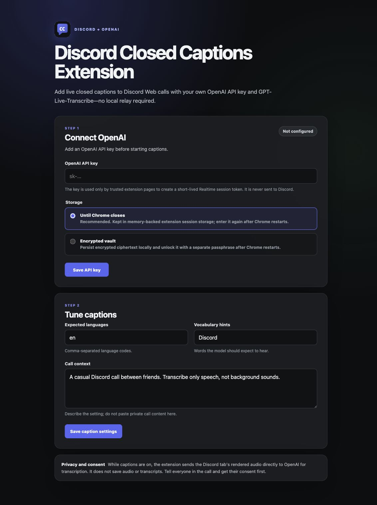
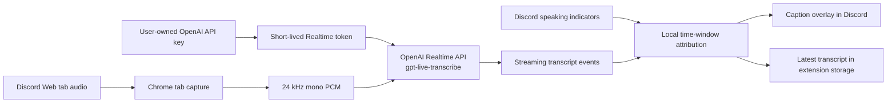

# Discord Closed Captions Extension

Chrome extension for adding closed captions to Discord calls via OpenAI's GPT-Live-Transcribe.



The extension captures the audio already playing in a Discord Web tab, sends
it directly to OpenAI for live transcription, and draws streaming captions over
the call. It is fully self-contained: there is no local relay, hosted backend,
Discord bot, or Discord account token.

> [!IMPORTANT]
> Bring your own OpenAI API key. API usage is billed to that OpenAI account and
> is separate from a ChatGPT subscription. Tell everyone in the call that live
> transcription is enabled and get their consent before starting.

## Features

- Start and stop controls in a compact Chrome toolbar popup
- Live partial captions and finalized caption segments
- A readable caption overlay inside Discord, including fullscreen calls
- A locally saved latest-session transcript, on by default and viewable in the popup
- Best-effort Discord speaker names in both overlay captions and saved transcripts
- Speaker detection from Discord's current call-tile speaking rings and accessible participant labels
- Explicit overlap ambiguity across calls with dozens of participants
- Graceful cleanup of stale monitoring when an unpacked extension is reloaded
- Optional local-microphone transcription, off by default
- Continued Discord audio playback while tab capture is active
- Direct Realtime API connection using `gpt-live-transcribe`
- No stored audio, Discord credentials, private gateway access, or hosted call history
- Durable device-local API key storage by default
- Optional passphrase-encrypted local API key vault
- Language, vocabulary, and call-context hints

## How it works



The standard API key is used from a trusted extension context to call OpenAI's
Realtime client-secret endpoint. The resulting short-lived credential
authenticates the browser WebSocket. The standard key is never sent to Discord,
the Discord content script, a project server, or a URL.

Only the tab's rendered output is captured by default. In a typical call, that
includes remote participants and Discord notification sounds. If **Transcribe
my microphone** is enabled, the extension mixes the local microphone into the
transcription stream without playing it back through the speakers.

Speaker attribution runs alongside transcription and never blocks caption
delivery. The content script samples Discord's visible call-tile speaking rings,
including rings painted with CSS shadows, and reads the participant names that
Discord exposes through accessible tile and avatar labels. It then scores the
indicators that were active during the recent transcription window. A dominant
match is shown as one name in both the page overlay and saved transcript;
comparable overlap is shown as `Alex or Sam`. The extension does not read
Discord account tokens, connect to a private Discord gateway, or retain a fixed
participant roster, so the same mechanism works as participants join and leave
large calls.

## Requirements

- Chrome 116 or newer
- Discord Web at [discord.com/app](https://discord.com/app)
- An [OpenAI API key](https://platform.openai.com/api-keys) with API billing and
  access to `gpt-live-transcribe`

The native Discord desktop application is not supported because Chrome cannot
capture another application's audio with the tab-capture API.

## Install from source

1. Clone or download this repository.
2. Open `chrome://extensions` in Chrome.
3. Enable **Developer mode**.
4. Choose **Load unpacked** and select the repository's `extension/` directory.
5. Pin **Discord Closed Captions Extension** to the toolbar.

The options page opens after the first installation.

## Configure the OpenAI API key

Enter an API key in the extension options and choose one of the storage modes:

### Remember on this device — recommended

The key is kept in `chrome.storage.local`, restricted to trusted extension
contexts, and remains available after Chrome restarts and extension reloads.
This is the least-friction option. It is not passphrase-encrypted, so use the
encrypted vault instead on a shared or less-trusted Chrome profile.

### Encrypted vault

The extension encrypts the API key with AES-256-GCM using a key derived from a
separate passphrase with PBKDF2-SHA-256. Only the ciphertext, salt, IV, and
format metadata are persisted in `chrome.storage.local`. After Chrome restarts,
the toolbar popup asks for the passphrase; the API key itself does not need to
be entered again. The plaintext key is placed in trusted session storage only
after the vault is unlocked.

Use a strong, unique passphrase. It cannot be recovered if forgotten.

### Until Chrome closes

The plaintext key is kept in `chrome.storage.session`, which is memory-backed,
restricted to trusted extension contexts, and cleared when Chrome restarts or
the extension reloads. Nothing secret is persisted to disk by the extension.

No storage mode uses `chrome.storage.sync`, and the options page never restores a
saved API key into an HTML input.

### Security boundary

These controls protect against Discord page scripts, accidental browser sync,
casual storage inspection, and—when the encrypted vault is locked—offline
profile copying. They do not make a browser extension equivalent to server-side
key custody. Malicious extension code, a compromised extension update, a
debugger, or malware running with the user's privileges could use an unlocked
key.

For additional containment, use a dedicated OpenAI project and API key, set a
low project budget and notification thresholds, review usage regularly, and
rotate the key if anything looks unexpected.

## Use captions

1. Join a call in Discord Web.
2. Confirm everyone has consented to live transcription.
3. Click the extension's toolbar icon in the active Discord tab.
4. Choose **Start** in the popup.
5. Watch the status indicator turn green when live captions are ready.
6. Open the popup at any time to review the transcript or quick settings.
7. Choose **Stop**—or the close button above the captions—to stop.

Chrome displays its normal capture indicator while the extension is listening
to the selected tab. Audio is never retained. When transcript saving is on,
only finalized text and best-effort speaker labels for the latest session are
stored locally; **Clear** in the popup removes them.

## Caption settings

The extension options include:

| Setting | Purpose |
| --- | --- |
| Expected languages | Comma-separated language codes such as `en, es` |
| Vocabulary hints | Names, places, acronyms, and other expected terms |
| Call context | Short, non-sensitive context that can improve transcription |
| Save latest transcript | Stores finalized captions locally; on by default |
| Show Discord speaker names | Attributes recent speaking indicators; on by default |
| Transcribe my microphone | Includes and labels local speech; off by default |

The three session-feature switches are also available directly in the toolbar
popup. Microphone changes apply when the next caption session starts.

## Permissions

| Permission | Why it is needed |
| --- | --- |
| `activeTab` | Limits toolbar actions to the user-selected active tab |
| `tabCapture` | Captures audio from the active Discord Web tab after a toolbar click |
| `offscreen` | Keeps audio processing active outside the Discord page |
| `storage` | Stores preferences, key state, optional encrypted vault data, and the optional latest transcript |
| `https://discord.com/*` | Injects and updates the caption overlay |
| `https://api.openai.com/*` | Creates a short-lived session credential and connects to transcription |

The content security policy permits network connections only to OpenAI. The
extension contains no remote JavaScript and accepts messages only from its own
extension ID. Optional microphone capture uses the browser's normal permission
prompt when the user enables it.

## Privacy and consent

While captions are active, captured tab audio is sent directly to OpenAI for
processing. Review [OpenAI's API data usage policies](https://openai.com/policies/api-data-usage-policies/)
for current service details.

The extension itself does not record or persist audio. Latest-session transcript
storage is on by default, remains local to the extension, is bounded to 500
entries/120,000 characters, and can be disabled or cleared in the popup.
Recording and interception laws vary by location; this project is not legal
advice. Do not use it on calls where you are not a participant or where the
other participants have not consented.

## Troubleshooting

### The popup says the key is missing or locked

The API key is missing or the encrypted vault is locked. Add a key in settings
or unlock the saved vault directly in the popup, then choose **Start**.

### Speaker name is missing or ambiguous

Attribution is best effort because Discord does not expose its authenticated
speaking event stream to ordinary content extensions. Keep the voice roster or
call tiles mounted so speaking indicators exist in the DOM. When comparable
indicators overlap, the extension intentionally shows both likely names rather
than inventing certainty. Speaker labels are assigned as new captions arrive;
previously saved `Unknown speaker` entries are not renamed retroactively.

### My voice is not transcribed

Enable **Transcribe my microphone**, allow microphone access, then start a new
caption session. The setting is off by default and does not alter a session that
is already running.

### OpenAI rejects the session

Verify that the key is active, belongs to an API project with billing enabled,
and can access `gpt-live-transcribe`. ChatGPT subscriptions do not include API
credits.

### No captions appear

- Confirm the active tab is on `https://discord.com/`.
- Confirm the call audio is actually playing from that tab.
- Reload the unpacked extension after pulling code changes, then confirm the
  saved key is ready or unlock the encrypted vault. Reloading stops any stale
  speaker-monitoring loop from the previous extension context; refresh the
  Discord tab before starting captions again.
- Check the extension service worker and offscreen-document consoles from
  `chrome://extensions` for sanitized error messages.

### The other participant cannot see captions

The overlay is local to the person running the extension. Each participant who
wants captions should install and run it themselves.

## Development

The runtime extension has no npm dependencies. Node.js 20 or newer is used for
checks, tests, local UI preview, and packaging.

```bash
npm install
npm run check
npm test
```

Preview the options page and popup without installing the extension:

```bash
npm run preview
```

Create a distributable zip in the ignored `dist/` directory:

```bash
npm run package:extension
```

The checks validate all JavaScript syntax and keep the package and extension
versions aligned. Unit tests cover PCM conversion, settings normalization,
encrypted-vault round trips and restart persistence, Realtime session
configuration, token exchange, transcript storage, large-call speaker scoring,
Discord speaking-ring and accessible-name detection, and transcript event
mapping.

## Repository layout

```text
.
├── docs/                 # README assets
├── extension/            # Manifest V3 extension source
│   ├── key-vault.js      # Session and passphrase-encrypted BYOK storage
│   ├── openai-realtime.js # Direct OpenAI Realtime client
│   ├── offscreen.js      # Tab audio capture and streaming lifecycle
│   ├── popup.*            # Toolbar controls and latest transcript
│   ├── speaker-attribution.js # Time-window attribution scoring
│   ├── speaker-dom.js     # Speaking-ring detection and participant-name lookup
│   ├── transcript-store.js # Bounded latest-session text storage
│   └── content.js        # Discord overlay and speaker-monitoring lifecycle
├── scripts/              # Checks, preview server, and packaging
├── test/unit/            # Deterministic unit tests
├── LICENSE
├── package.json
└── README.md
```

## References

- [OpenAI Realtime transcription](https://developers.openai.com/api/docs/guides/realtime-transcription)
- [OpenAI Realtime WebSocket](https://developers.openai.com/api/docs/guides/realtime-websocket)
- [OpenAI API key safety](https://help.openai.com/en/articles/5112595-best-practices-for-api-key)
- [Chrome tab capture](https://developer.chrome.com/docs/extensions/how-to/web-platform/screen-capture)
- [Chrome extension storage](https://developer.chrome.com/docs/extensions/reference/api/storage)

## License

[MIT](LICENSE)
